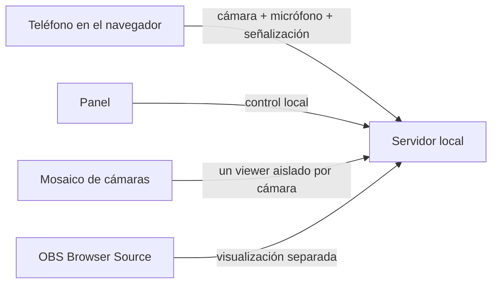

# Arquitectura técnica

[EN](ARCHITECTURE.md) | [FR](ARCHITECTURE.fr.md) | [ES](ARCHITECTURE.es.md)

Wiki principal: [Inicio](../wiki/Home.es.md)

## Resumen

BouCamPhoneServ divide el proyecto en tres capas:

- el teléfono
- el servidor local
- la salida OBS

## Flujo de datos

## Rol de cada parte

### Teléfono

- abre una página web
- solicita acceso a cámara y micrófono
- envía vídeo y audio
- puede cambiar de cámara o silenciar el micrófono

### Servidor local

- sirve las páginas HTML
- gestiona las sesiones
- reenvía mensajes entre el teléfono y la vista OBS
- enruta cada oferta WebRTC y candidato ICE con un `viewerId` único, permitiendo que OBS y el mosaico miren simultáneamente
- proporciona el certificado local opcional
- inicia el icono de notificación de Windows y permite detener de forma segura el proceso del servidor

### Panel

- muestra los teléfonos activos
- enseña códigos QR
- permite copiar enlaces
- permite enviar comandos simples

### Fuente OBS

- toma el vídeo de la sesión seleccionada
- muestra cada teléfono como una fuente independiente

### Mosaico de cámaras

- crea un viewer WebRTC aislado para cada teléfono activo
- inicia cada tarjeta sin sonido para garantizar la reproducción automática del navegador
- reconecta las tarjetas de forma independiente sin interrumpir OBS

## Por qué este enfoque

Este enfoque mantiene:

- una instalación mínima
- amplia compatibilidad con navegadores
- una integración limpia con OBS
- una base que luego puede evolucionar hacia Linux o Raspberry Pi

## Apoya el proyecto

Donar: [https://streamlabs.com/bouglitv](https://streamlabs.com/bouglitv)

## Licencia y contribuciones

BouCamPhoneServ tiene licencia `AGPL-3.0-only`.
Las contribuciones deben firmarse con `Signed-off-by:` para cumplir con DCO 1.1.
