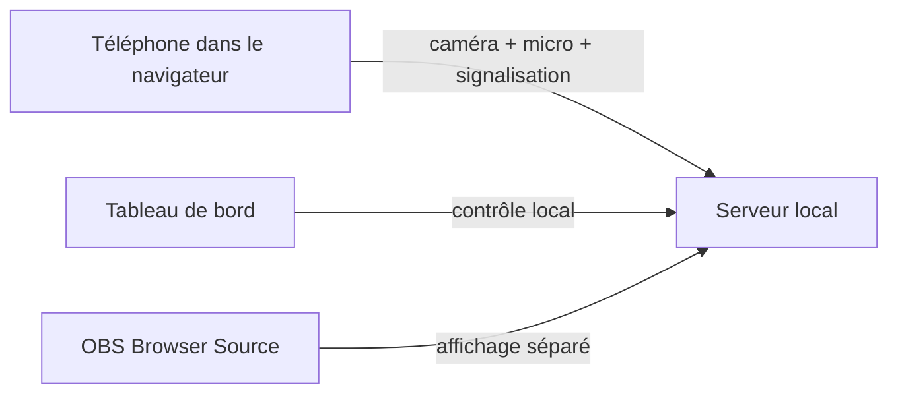

# Architecture technique

## Vue d’ensemble

Cam From Phone sépare le projet en trois couches :

- le téléphone
- le serveur local
- la sortie OBS

## Flux des données

## Rôle de chaque partie

### Téléphone

- ouvre une page web
- demande l’accès caméra et micro
- envoie le flux vidéo et audio
- peut changer de caméra ou couper le micro

### Serveur local

- sert les pages HTML
- gère les sessions
- transmet les messages entre téléphone et vue OBS
- fournit le certificat local

### Tableau de bord

- affiche les téléphones actifs
- montre les QR codes
- permet de copier les liens
- permet d’envoyer des commandes simples

### Source OBS

- récupère la vidéo de la session choisie
- affiche chaque téléphone comme une source indépendante

## Pourquoi ce choix

Cette approche garde :

- une installation minimale
- une compatibilité navigateur large
- une intégration propre avec OBS
- une base facile à faire évoluer plus tard vers Linux ou Raspberry Pi
