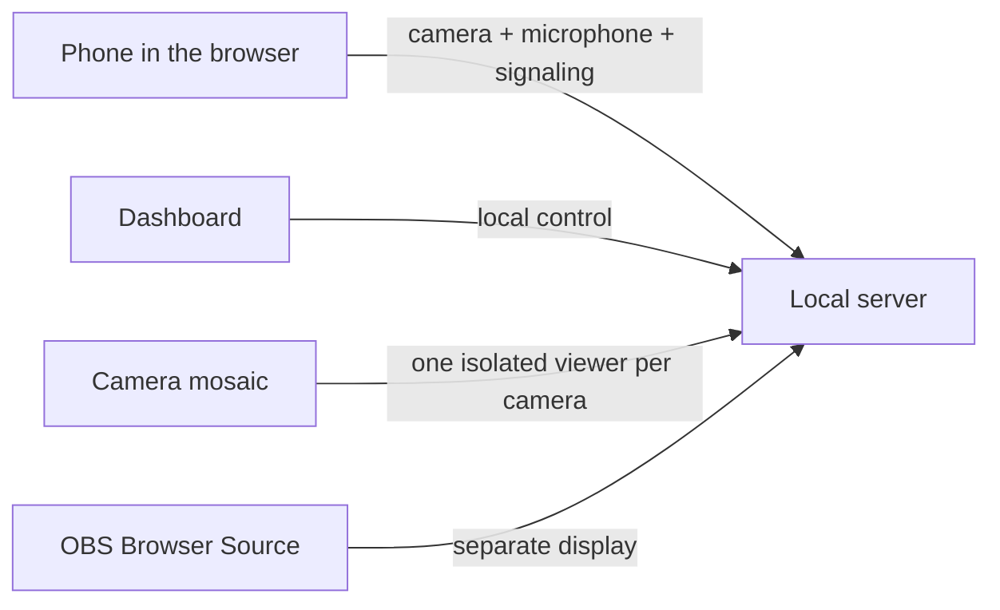

# Technical Architecture

[EN](ARCHITECTURE.md) | [FR](ARCHITECTURE.fr.md) | [ES](ARCHITECTURE.es.md)

Wiki home: [Home](../wiki/Home.md)

## Overview

BouCamPhoneServ separates the project into three layers:

- the phone
- the local server
- the OBS output

## Data Flow

## Role of Each Part

### Phone

- opens a web page
- requests camera and microphone access
- sends video and audio
- can switch camera or mute the microphone

### Local Server

- serves the HTML pages
- manages sessions
- forwards messages between the phone and the OBS view
- routes each WebRTC offer and ICE candidate with a unique `viewerId`, allowing OBS and the mosaic to watch concurrently
- provides the optional local certificate
- starts the Windows notification icon and lets it stop the server process safely

### Dashboard

- shows active phones
- displays QR codes
- lets you copy links
- lets you send simple commands

### OBS Source

- pulls video from the selected session
- shows each phone as an independent source

### Camera Mosaic

- creates one isolated WebRTC viewer for every active phone
- starts every tile muted for reliable browser autoplay
- reconnects tiles independently without interrupting OBS

## Why This Approach

This approach keeps:

- the installation footprint minimal
- broad browser compatibility
- a clean OBS integration
- a base that can later evolve toward Linux or Raspberry Pi

## Support the Project

Donate: [https://streamlabs.com/bouglitv](https://streamlabs.com/bouglitv)

## License and Contributions

BouCamPhoneServ is licensed under `AGPL-3.0-only`.
Contributions must be signed off with `Signed-off-by:` to comply with DCO 1.1.

French version: [ARCHITECTURE.fr.md](ARCHITECTURE.fr.md)
